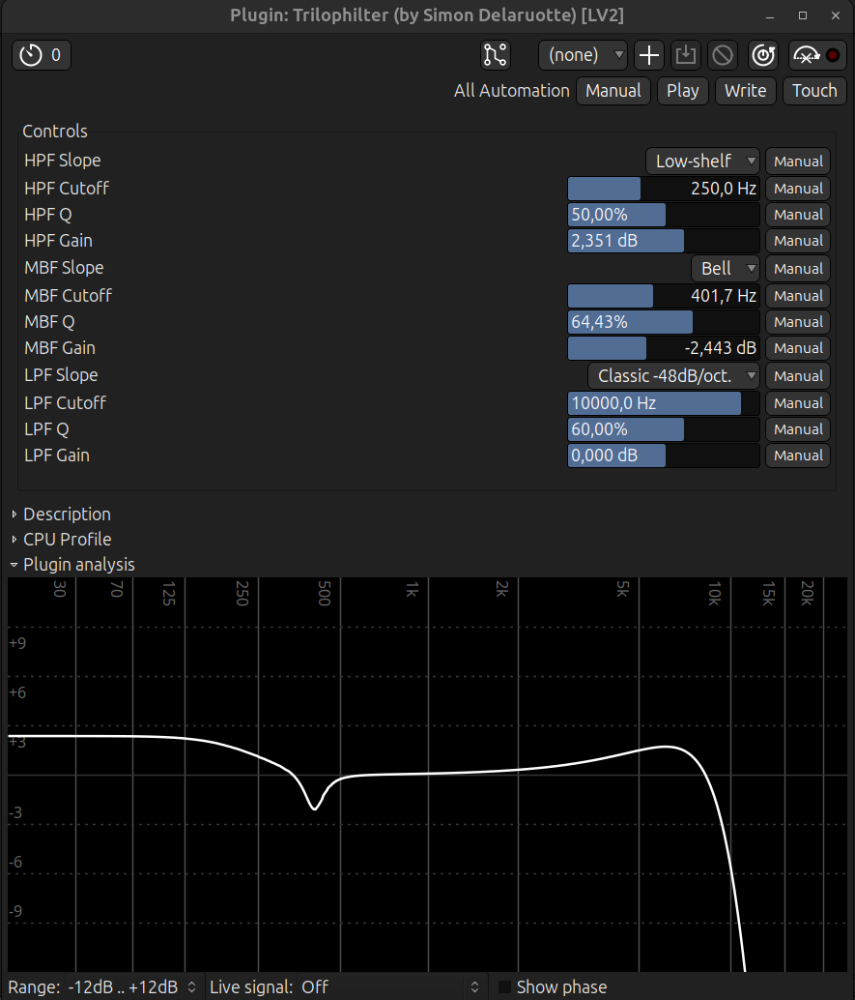

# Trilophilter LV2 Plugin
Three-band filter plugin with independent high-pass, mid-band, and low-pass filters, designed for low CPU usage. The high and low filters offer multiple slope options for Classic, Butterworth and Linkwitz-Riley responses, while the mid-band filter features Bell and Notch modes for precise frequency shaping.

 
*Plugin controls as displayed by Ardour's default generic UI. Your host may show controls differently. The frequency analysis graph shown below the controls is part of Ardour's plugin window, not a feature of this plugin.*

## Features

- Independent high-pass, mid-band, and low-pass filters
- Multiple slope options for the high and low filters :
  - Off (filter bypassed)
  - Classic -12dB/octave
  - Classic -24dB/octave
  - Butterworth -24dB/octave
  - Butterworth -48dB/octave
  - Linkwitz-Riley -48dB/octave
  - Linkwitz-Riley -96dB/octave
  - Low-Shelf (with adjustable Gain)
  - High-Shelf (with adjustable Gain)
- Mid-band filter slope options :
  - Bell (with adjustable Gain)
  - Notch
- Adjustable cutoff frequency (20Hz-20kHz) for all three filters
- Resonance/Q control for Classic modes, Shelves, Bell and Notch slopes
- Gain control (-12dB to +12dB) for Shelf and Bell filters
- Butterworth and Linkwitz-Riley modes ignore resonance
- No custom GUI — uses host's generic controls
- Stereo input/output
- No dependencies beyond LV2 SDK

## Project Home

<https://simdott.github.io/trilophilter>

## Plugin URI

`urn:simdott:trilophilter`

## Dependencies

- C compiler (gcc, clang, etc.)
- LV2 development headers

### Installation by distribution

**Debian/Ubuntu** :
sudo apt-get install build-essential lv2-dev

**Fedora** :
sudo dnf install gcc lv2-devel

**Arch** :
sudo pacman -S base-devel lv2

## Build and Install

1. Download the source :
   git clone https://github.com/simdott/trilophilter
   cd trilophilter

2. Install for current user (recommended) :
   sh install.sh
   
   Or install system-wide (requires sudo) :
   sudo sh install.sh

## Verification

List installed plugins :
lv2ls | grep trilophilter

Should show : `urn:simdott:trilophilter`

## Usage

Load in any LV2-compatible host (Ardour, Carla, Reaper, etc.). Connect stereo inputs/outputs. 

Each filter operates independently :

- **High-Pass Filter (HPF)** : Use Slope, Cutoff, and Q controls to shape the low end 
- **Mid-Band Filter (MBF)** : Use Slope, Cutoff, and Q controls to shape the mid band 
- **Low-Pass Filter (LPF)** : Use Slope, Cutoff, and Q controls to shape the high end

**Classic modes** : Resonance (Q) shapes the filter's response at the cutoff frequency :
- **Low Q values (<50%)** : Gentle, broad filter 
- **50%** : Standard flat response (Q=0.707) 
- **High Q values (>50%)** : Resonant peak, more pronounced as Q increases

**Butterworth modes** : Provide flat passband response. Individual low-pass and high-pass outputs are -3dB at cutoff. **Q control has no effect in these modes**.

**Linkwitz-Riley modes** : Provide flat summed response for crossover applications. Individual low-pass and high-pass outputs are -6dB at cutoff. **Q control has no effect**.

**High-Shelf/Low-Shelf** : 
- **Low-Shelf** : Boosts/cuts below cutoff frequency 
- **High-Shelf** : Boosts/cuts above cutoff frequency 
- **Cutoff** : Transition frequency 
- **Gain** : Amount of boost/cut (-12dB to +12dB) 
- **Q (Resonance)** : Steepness of the shelf transition (0% to 100%) 
  - 0% = Very gentle slope (Q=0.3) 
  - 50% = Classic Butterworth slope (default - Q=0.707) 
  - 100% = Steep, aggressive slope (Q=1.5)

**Bell mode** :
- **Bell** : Boosts or cuts a specific frequency range 
- **Cutoff** : Center frequency of the bell curve 
- **Gain** : Amount of boost/cut (-12dB to +12dB) 
- **Q (Resonance)** : Width of the bell curve (0% to 100%) 
  - 0% = Very wide, extremely gentle curve (Q=0.2) 
  - 50% = Moderate width, versatile for mixing (default - Q=3.0) 
  - 100% = Very narrow, surgical cut or boost (Q=10.0)

**Notch mode** :
- **Notch** : Removes or attenuates a specific frequency range 
- **Cutoff** : Center frequency of the notch 
- **Gain** : Has no effect in Notch mode 
- **Resonance (Q)** : Width of the notch (0% to 100%) 
  - 0% = Wide notch, affects broader frequency range (Q=0.5) 
  - 50% = Medium notch, good for general problem removal (default - Q=2.0) 
  - 100% = Narrow notch, precise frequency removal (Q=8.0) 
- **Note** : Unlike Bell mode, Notch only cuts (attenuates) frequencies and does not boost

**To bypass a filter** : Set its Slope control to "Off".

**Interface** : this plugin has no custom graphical interface. It uses your host's standard control UI (slider, knob, or numerical entry).

**Note for Carla Users** : the cutoff frequency and the resonance/Q controls use the LV2 `pprops:logarithmic` hint for logarithmic scaling. This works in Ardour and most hosts, but Carla currently displays these controls linearly. This is a host implementation difference, not a plugin issue.
If precise logarithmic control in Carla is important to you, please let me know by opening an issue — this helps me prioritize a custom GUI in the future.

## Technical Notes

All filters implemented as IIR biquad cascades.
Designed for minimal CPU usage (no oversampling and phase response is non-linear) while providing versatile filter options.
Aliasing may occur near Nyquist with high cutoff frequencies.

## Files

- trilophilter.c - Plugin source code
- trilophilter.ttl - Plugin description (ports, properties)
- manifest.ttl - Bundle manifest
- install.sh - Build and install script
- uninstall.sh - Uninstall script

## Uninstall

1. Open a terminal in the plugin's folder.

2. Uninstall for current user :
   sh uninstall.sh

   Or uninstall system-wide :
   sudo sh uninstall.sh
   
## Latest Version

- v1.0.0 (2026-05-25) - Initial release

## License

GPL-2.0-or-later

## Author

Simon Delaruotte (simdott) 
